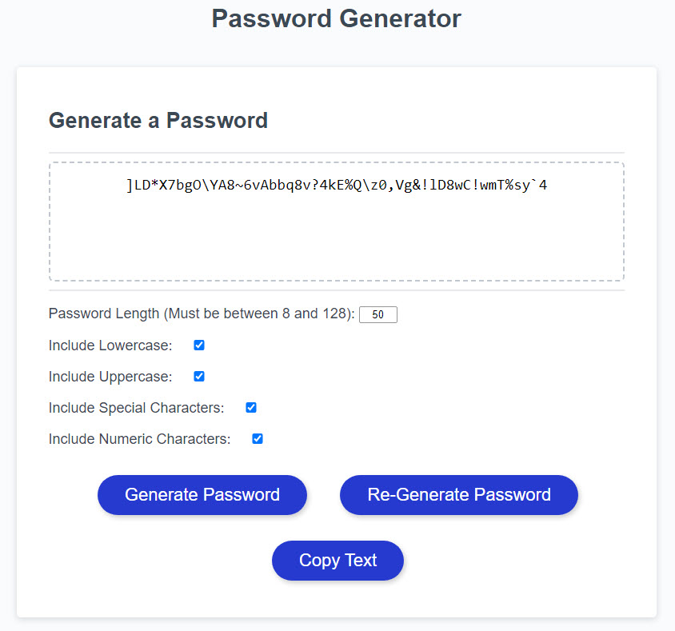
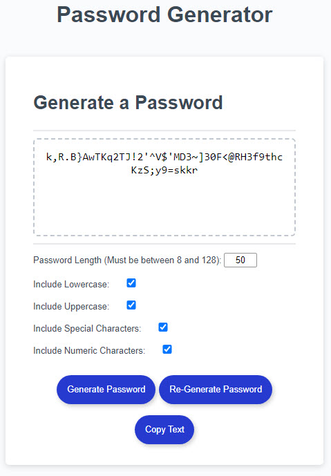

# Password Generator

  

## :lock: Description

Password Generator creates a unique password based on the criteria provided by the user.

---

## Table of Contents

- [Features](#features)
- [Application](#application)
- [Preview](#preview)
- [Instructions](#instructions)
- [Usage](#usage)
- [Questions](#questions)

---

## Features

- Length of password from 8 to 128 characters
- If the password should contain:
  - Uppercase letters
  - Lowercase letters
  - Numbers
  - Special Characters
- Validation that the output meets the criteria chosen
- And local storage of password criteria preferences to reuse if the user requests a different password
- Mobile responsive layout

---

## Application

Link to the application:
[Password Generator](https://yiladien.github.io/Password_Generator/)

---

## Preview

Screenshot of the application screens

#### Desktop Version:

#### Mobile Version:

---

## Instructions

#### First time use

1. Open the application using the link above
2. Fill out the form giving the criteria for the password
3. Click Generate Password
4. The password will be provided in the text box on the screen. You can click the Copy Text button to paste in another application.

#### Subsequent use

1. Open the application using the link above
2. Click the Re-Generate Password button to create a new password using the previously selected criteria.
3. Or update the criteria and click Generate Password to update your preferred password criteria.

---

## Usage

Free to use. Refer to this github repository if possible.

---

## Questions

Please contact the owner with any questions.

Email: yiladien@hotmail.com

GitHub profile: https://github.com/Yiladien

---
